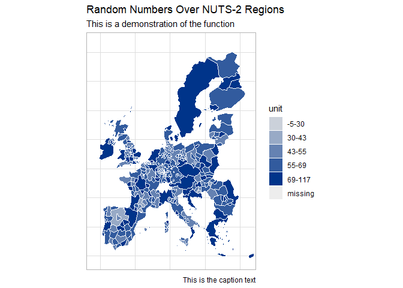

<!-- README.md is generated from README.Rmd. Please edit that file -->

# satellitereport

<!-- badges: start -->

<!-- badges: end -->

The goal of satellitereport is to facilitate cooperation with
[satellitereport.com](satellitereport.com)

## Installation

You can install the satellitereport from [GitHub](https://github.com/)
with:

``` r
# install.packages("devtools")
devtools::install_github("antaldaniel/satellitereport")
```

## Example

This is how you create a choropleth map.

``` r
library(satellitereport)
require(eurostat)
require(dplyr)
require(ggplot2)

all_geo_codes <- unique(eurostat::regional_changes_2016$code16)
all_geo_codes <- all_geo_codes [!is.na(all_geo_codes)]

test_intervals <- data.frame (
  geo = all_geo_codes,
  values = rnorm(length(all_geo_codes), mean = 50, sd = 15),
  row.names = NULL
)

create_choropleth ( dat = test_intervals,
                    geo_var = 'geo', values_var='values',
                    na_color = 'grey93', unit_text = 'unit', 
                    level=2, n=5, style ='kmeans') +
  ggplot2::labs( title = "Random Numbers Over NUTS-2 Regions", 
                 subtitle = "This is a demonstration of the function",
                 caption = "This is the caption text")
```



## Code of Conduct

Please note that the ‘satellitereport’ package is released with a
[Contributor Code of Conduct](CODE_OF_CONDUCT.md). By contributing to
this project, you agree to abide by its terms.
