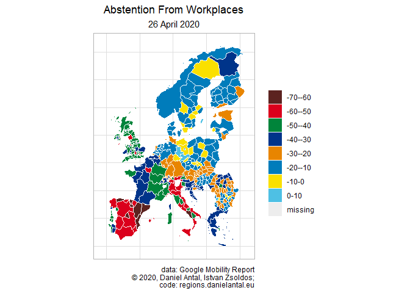
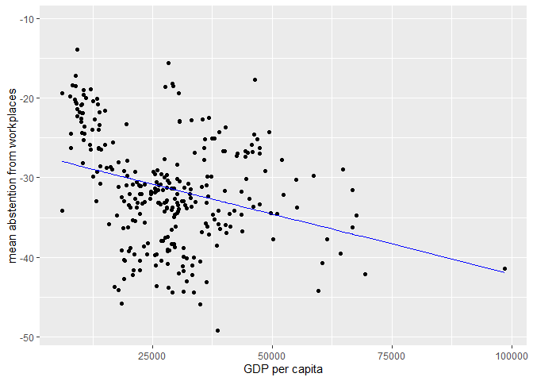

Working With Google Data
================
Daniel Antal, CFA
6/11/2020

## Read In Google Data

Read in the Google Mobility Report data from your path.

``` r
data ("google_nuts_matchtable", package = "regions")
## refer to your own version of the file
gmr <- readr::read_csv("../../regions/data-raw/Global_Mobility_Report.csv")

europe <- gmr %>%
  mutate ( sub_region_1 = ifelse (
    # use country name as geographical name if there is no regional 
       test = nchar(sub_region_1)<2,
       yes  = country_region,
       no   = sub_region_1)
       ) %>%
  purrr::set_names (., c("country_code", "country_region",
                        "google_region_name", "sub_region_2",
                        "date",
                        "retail", "grocery", "parks",
                        "transit",
                        "workplaces", "residential"
                       )) %>%
  filter (
    # Work only with countries in the regions package vocabulary
    country_code %in% google_nuts_matchtable$country_code 
    ) %>%
  select ( -all_of(c("sub_region_2", "country_region")) ) %>%
  pivot_longer ( 
    # bring the data to a long format for matching with 
    # the matchtable (correspondence table)
                 data =.,
                 cols = c("retail", "grocery", "parks",
                          "transit",
                          "workplaces", "residential"),
                 names_to = "location_type",
                 values_to = "values")
```

And join in the correspondence table that has European NUTS statistical
codes. More info: `?regions::google_nuts_matchtable` or [Google Mobility
Report European Correspondence
Table](http://regions.danielantal.eu/reference/google_nuts_matchtable.html).

``` r
gmr_nuts <- europe %>%
  left_join ( google_nuts_matchtable %>%
                select ( all_of(c("country_code",
                                  "google_region_name",
                                  "typology",
                                  "code_2016"))),
              by =c("country_code", "google_region_name"))
```

The following code contains a proprietary function, which is a
complicated wrapper around `ggplot2`, `sf` and `classInterval` functions
to create choropleth map of the data.

``` r
require(satellitereport) # only available in github
require(sf)              # available on CRAN
```

    ## Loading required package: sf

    ## Linking to GEOS 3.8.0, GDAL 3.0.4, PROJ 6.3.1

``` r
require(ggplot2)          # available on CRAN, part of tidyverse
```

    ## Loading required package: ggplot2

``` r
example <-  gmr_nuts %>%
  filter ( date == "2020-04-26") %>%
  filter ( location_type == "workplaces") %>%
  mutate ( code_2016 = case_when(
    # small countries are treated as a single NUTS0 unit 
    # because their data is given by Google in lower than 
    # NUTS3 resolution
    country_code == "IS" & is.na(google_region_name) ~ "IS",
    country_code == "EE" & is.na(google_region_name) ~ "EE",
    country_code == "LV" & is.na(google_region_name) ~ "LV",
    country_code == "MT" & is.na(google_region_name) ~ "MT",
    country_code == "LU" & is.na(google_region_name) ~ "LU",
    country_code == "NO" & is.na(google_region_name) ~ "NO",
    country_code == "SI" & is.na(google_region_name) ~ "SI",
    TRUE ~ code_2016 )) %>%
  filter ( ! code_2016 %in% c("LV00", "LV006") ) %>%
  filter ( !is.na(code_2016) ) %>%
  rename ( geo  = code_2016 )

require(satellitereport)
create_choropleth( dat = example,
                   values_var = "values",
                   n = 8,
                   color_palette = sr_palette()[
                     c("brown", "red", "darkgreen", "darkblue",
                       "orange", "blue", "yellow",  "lightblue"
                      )],
                   na_color = "grey93") +
  theme ( plot.caption = element_text(hjust = 1),
          plot.title = element_text(hjust = 0.5),
          plot.subtitle = element_text(hjust = 0.5)) +
  labs ( title = "Abstention From Workplaces",
         subtitle = "26 April 2020",
         caption = "data: Google Mobility Report
         \ua9 2020, Daniel Antal, Istvan Zsoldos;
         code: regions.danielantal.eu")
```

<!-- -->

## Join With Eurostat Data

Let us get some data that has NUTS1 - NUTS2 - NUTS3 resolution.

This is GDP per capita, but you can work with nominal GDP (change to
`filter == MIO_EUR` or other units.)

``` r
gdp_raw <- eurostat::get_eurostat(id = 'nama_10r_3gdp',
                                  time_format = "num" )

gdp_hab <- gdp_raw %>%
  filter ( 
           # filter euro per capita (habitant) & single year
           unit == 'EUR_HAB', 
           time == 2018 ) %>%
  select ( -all_of(c("unit")) ) %>%
  regions::validate_nuts_regions() %>%
  rename ( gdp_hab = values )
```

Add the population data. we are deducting the cohorts less then five
years old, ages 5-9, and ages 10-14 from the population.

``` r
population_raw <- eurostat::get_eurostat("demo_r_pjangrp3",
                                     time_format = "num") 

population <- population_raw %>%
  filter ( # Both sexes = T, unit = number, time = 2018
           sex == "T", 
           unit == "NR", 
           time == 2018, 
           # filter total and not yet working cohorts 
           age %in% c("Y10-14", "Y5-9", "Y_LT5", "TOTAL")
           ) %>%
  mutate ( age = tolower(gsub("-|_", "", age ))) %>%
  pivot_wider ( names_from = "age", 
                values_from = "values") %>%
  dplyr::rename ( population_total = total ) %>%
  mutate ( population_ge15 = 
             population_total - y59 - y1014 - ylt5 ) %>%
  select ( -all_of(c("y59", "y1014", "ylt5",
                     "sex", "unit", "time")))
```

Now you can perform the join by NUTS geocodes, following the NUTS2016
definitions.

``` r
gmr_eurostat_join <- gmr_nuts %>%
  mutate ( code_2016 = ifelse ( 
    ## when no region name is given, use the country code 
    test = is.na(code_2016) & is.na(google_region_name), 
    yes = country_code, 
    no = code_2016)
    ) %>%
  pivot_wider ( names_from  = "location_type", 
                values_from = "values" ) %>%
  select ( -all_of(c("google_region_name", "typology"))) %>%
  rename ( geo = code_2016 ) %>%
  left_join ( gdp_hab, by = 'geo' )  %>%
  left_join ( population, by = 'geo')
```

## A Simple Model

``` r
gmr_means <- gmr_eurostat_join %>%
  group_by ( geo ) %>%
  summarize_if (is.numeric, mean, na.rm=TRUE )
fit <- lm ( workplaces ~ gdp_hab, data = gmr_means) 
summary (fit)
```

    ## 
    ## Call:
    ## lm(formula = workplaces ~ gdp_hab, data = gmr_means)
    ## 
    ## Residuals:
    ##      Min       1Q   Median       3Q      Max 
    ## -16.3023  -3.5551  -0.2648   5.1873  16.2864 
    ## 
    ## Coefficients:
    ##               Estimate Std. Error t value Pr(>|t|)    
    ## (Intercept) -2.705e+01  9.029e-01 -29.954  < 2e-16 ***
    ## gdp_hab     -1.504e-04  2.837e-05  -5.302 2.28e-07 ***
    ## ---
    ## Signif. codes:  0 '***' 0.001 '**' 0.01 '*' 0.05 '.' 0.1 ' ' 1
    ## 
    ## Residual standard error: 6.555 on 288 degrees of freedom
    ##   (213 observations deleted due to missingness)
    ## Multiple R-squared:  0.08893,    Adjusted R-squared:  0.08576 
    ## F-statistic: 28.11 on 1 and 288 DF,  p-value: 2.284e-07

``` r
summary (lm ( residential ~ gdp_hab, data = gmr_means) )
```

    ## 
    ## Call:
    ## lm(formula = residential ~ gdp_hab, data = gmr_means)
    ## 
    ## Residuals:
    ##      Min       1Q   Median       3Q      Max 
    ## -11.8031  -2.5276  -0.2433   1.7789  10.5942 
    ## 
    ## Coefficients:
    ##              Estimate Std. Error t value Pr(>|t|)    
    ## (Intercept) 1.010e+01  5.409e-01  18.678  < 2e-16 ***
    ## gdp_hab     6.216e-05  1.702e-05   3.652 0.000309 ***
    ## ---
    ## Signif. codes:  0 '***' 0.001 '**' 0.01 '*' 0.05 '.' 0.1 ' ' 1
    ## 
    ## Residual standard error: 3.923 on 285 degrees of freedom
    ##   (216 observations deleted due to missingness)
    ## Multiple R-squared:  0.04471,    Adjusted R-squared:  0.04136 
    ## F-statistic: 13.34 on 1 and 285 DF,  p-value: 0.0003091

``` r
ggplot ( data = gmr_means,
         aes ( x = gdp_hab, 
               y = workplaces)
         ) +
  geom_point() +
  geom_line(data = fortify(fit), 
            aes(x = gdp_hab, 
                y = .fitted), 
            color = 'blue'
  ) +
  labs ( x = "GDP per capita",
         y = "mean abstention from workplaces")
```

    ## Warning: Removed 213 rows containing missing values (geom_point).

<!-- -->
